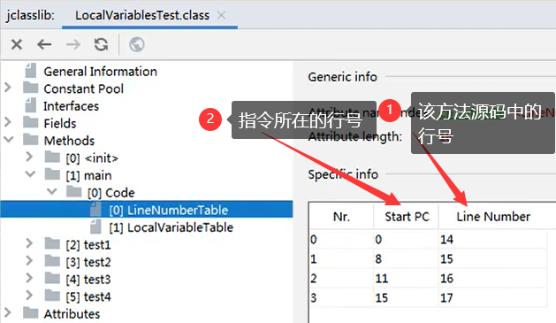

#一.JVM体系结构


Java编译器输入的指令流基本上是一种基于**栈的指令集架构**，另外一种指令集架构是基于**寄存器的指令集架构**，两种架构之间的区别：

**基于栈式架构的特点**：

- 设计和实现更简单，适用于资源受限的系统
- 避开了寄存器的分配难题：使用**零地址指令**方式分配
- 指令流中的指令大部分是零地址指令，其执行过程依赖于栈。指令集更小，编译器容易实现
- 不需要硬件支持，可移植性更好，更好实现跨平台

**基于寄存器架构的特点：**

- 指令集架构完全依赖硬件，可以执行差
- 性能优秀和执行更高效
- 花费更少的指令去完成一项操作

**查看程序指令码：javap -v -p class文件 > 文件名**

##1.类装载器ClassLoader

​	负责加载class文件，==class文件在文件开头有特定的文件标识，==将class文件字节码内容加载到内存中，并将这些内容装换成方法区中的运行时数据结构，ClassLoader只负责class文件的加载，至于它是否可以运行，则由Execution Engine决定。

###1.1.类加载过程


1. loading：通过一个类的全限定名获取定义此类的二进制字节流，将这个字节流所代表的静态存储结构转化为方法区的运行时数据结构，在堆内存中生成代表这个类的**java.lang.Class**对象，作为方法区这个类的各种数据的访问入口

2. linking：

   - 验证：确保class文件的字节流中包含的信息符合当前虚拟机的要求，保证被加载类的正确性，不会危害虚拟机自身安全
   - 准备：为类变量分配内存并设置该类变量的默认值，即零值。但不包含`final`修饰的类变量，因为`final`在编译的时候就分配了，准备阶段会显示赋值，同时也不会为成员变量分配初始化值，因为成员变量的初始化发生在对象的创建时
   - 解析：将常量池内的符号引用转换为直接引用的过程。解析动作主要针对类或接口、字段、类方法、接口方法、方法类型等，对应常量池中的CONSTANT_Class_info、CONSTANT_Fieldref_info、CONSTANT_Methodref_info等

3. initialization：初始化阶段就是执行**类构造器方法\<clinit>()**的过程，此方法不需要定义，是javac编译器自动收集类中的所有类变量的赋值动作和静态代码块中的语句合并而来。**\<clinit>()不同与类的构造器\<init>()**，如果类中不存在类变量或静态代码块，则不会生成**\<clinit>()**方法，但**\<init>()**方法一定会生成，因为所有类都有构造器。若该类有父类，JVM会保证父类的**\<clinit>()**方法先执行。虚拟机会保证一个类的**\<clinit>()**方法在多线程下被同步加锁，即在多线程下保证这个类只会加载一次

   ```java
   public class DeadThreadTest{
       public static void main(String[] args){
           Runnable r = () -> {
               System.out.println(Thread.currentThread().getName()+"开始");
               DeadThread thread = new DeadThread();
               System.out.println(Thread.currentThread().getName()+"结束");
           };
           new Thread(r,"线程1").start();
           new Thread(r,"线程2").start();
           //结果DeadTrhead类的静态代码块因为第一个加载类的线程没有完成加载过程导致进程被卡主，第二个线程不能执行类的加载
       }
   }
   
   class DeadThread{
       static{
           if(true){
               System.out.println(Thread.currentThread().getName()+"初始化该类");
               while(true){}
           }
       }
   }
   ```

**在IDEA的Plugins中搜索==jclasslib Bytecode viewer==插件安装后重启IDEA，打开一个class文件，在view中选择Show Bytecode with jclasslib即可以二进制码格式查看文件及程序的指令集**

```java
public class ClassInit{
    private static int num = 1;
    static{
        num = 2;
        number = 20;
        //System.out.println(number); Illegal forward reference
    }
    //将number变量声明在下方同样可以正常运行
    private static int number = 10;
    public static void main(String[] args){
        System.out.println(ClassInit.num); //2
        System.out.pirntln(ClassInit.number); //10
    }
}
/*
	原因：根据类的加载过程，在linking的准备阶段会收集所有的静态变量并为其赋零值，此时number变量已经存在，在之后的initializaiton阶段中执行类构造器方法，根据代码中赋值动作的顺序为类变量赋值，所以number的值的变化过程为：0 ---> 20 --->10。虽然可以正常赋值，但不能前置使用变量，会出现编译异常
*/
```

> 主动加载和被动加载

主动加载：

- 创建类的实例
- 访问某个类或接口的静态变量，或者对该静态变量赋值
- 调用类的静态方法
- 反射
- 初始化一个类
- Java虚拟机启动时被标明为启动类的类
- JDK7开始提供了动态语言支持：java.lang.invoke.MethodHandle实例的解析结果REF_getStatic、REF_putStatic、REF_invokeStatic句柄对应的类没有初始化则初始化

除了以上七种情况，其它使用Java类的方式都被看作是对类的**被动使用**，都**不会导致类的初始化**

###1.2.类装载器的分类


> 在虚拟机规范中，类加载器分为**启动类加载器**和**java.lang.ClassLoader子类的自定义加载器**

虚拟机自带的类加载器
1. 启动类加载器（Bootstrap），C++编写
   用于加载jdk中的类，由于是C++编写，所以通过==对象.getClass.getClassLoader()==获得的结果为null。被跟加载器已启动就加载进内存了，所以我们可以直接使用jdk中的类，主要用于加载以下类：
   
   - JAVA_HOMEjre/lib/rt.jar
   - sun.boot.class.path路径下的内容
   - 加载扩展类和应用程序类加载器，并指定他们的父类加载器
   - 出于安全考虑，BootStrap启动类加载器只加载包名为java、javax、sun等开头的类
   
   **获取BootstrapClassLoader可以加载的类库路径：**
   
   ```java
   public class test{
       public static void main(String args){
       	URL[] urls = sun.misc.Launcher.getBootstrapClassPath().getURLs();
           for(URL elements : urls){
               System.out.println(element.toExteralForm());
           }
   	}
   }
   ```
   
2. 扩展类加载器（Extension），java编写，java.lang.ClassLoader的子类，在虚拟机规范上属于自定义类加载器，主要加载**JDK的安装目录的jre/lib/ext目录的类库**，如果用户创建的类放在此目录下也会自动由该类加载器加载

3. 应用程序类加载器（AppClassLoader），java.lang.ClassLoader的子类
   Java也叫系统类加载器，加载当前应用的classpath的所有类，也就是自己编写的类
   ==对象.getClass.getClassLoader().getParent==获取上一级加载器名称

```java
public class ClassLoaderTest{
    public static void main(String[] args){
        ClassLoader systemClassLoader = ClassLoader.getSystemClassLoader();
        System.out.println(systemClassLoader);//sun.misc.Launcher$AppClassLoader@18b4aac2
		
        ClassLoader extensionClassLoader = systemClassLoader.getParent();
        System.out.println(systemClassLoader);//sun.misc.Launcher$ExtClassLoader@1540e19d
		
        ClassLoader bootstrapClassLoader = extensionClassLoader.getParent();
        System.out.println(systemClassLoader);//null
		
        ClassLoader classLoader = ClassLoaderTest.class.getClassLoader();
		System.out.println(systemClassLoader);//sun.misc.Launcher$AppClassLoader@18b4aac2
        
        ClassLoader classLoader2 = String.class.getClassLoader();
        System.out.println(classLoader2);//null
    }
}
```

**以上类加载器不是父子类关系，只是加载等级的关系**

###1.3.双亲委派机制

​	在`new`对象时，JVM会加载这个类；但并不会由本身的类加载器先加载，而是一层一层向上委托至最高类加载器，由最高级类加载器先加载，若这个类加载器不能加载（在它的加载路径下没有找到所需要加载的全限定类），则会交给下一级类加载器加载。双亲委派机制保证了沙箱安全（即jdk源代码不会被污染），比如若自己编写一个java.lang.String类加载时，由于双亲委派机制，这个类最终在BootstrapClassLoader的加载路径下（rt.jar包）找到对应的类，所以直接加载了jdk中的类，而不会加载我们编写的类，虽然我们编写与jdk相同的类名时编译不会报错。而如果在java.lang包下编写一个核心类库不存在的类，加载这个类时会报`Prohibited package name`异常，因为java.lang包在BootstrapClassLoader的加载路径中存在，会优先从核心类库的路径中找，没有找到就会抛出异常


**JVM必须知道一个类是由启动加载器加载还是由自定义类加载器加载，如果一个类由自定义类加载器加载，那么JVM会将这个类加载器的一个引用作为类信息的一部分保存在方法区中。当解析一个类到另一个类的引用时，JVM需要保证这两个类的类加载器相同**


## 2.运行时数据区结构

Java虚拟机的运行时数据区内部定义了若干种程序运行期间会使用到的数据区，其中==灰色区域为线程私有，会随着线程开始和结束而创建和销毁，发生的垃圾回收很少==，其它为==线程共有，随着虚拟机的启动而创建，随着虚拟机的推出而销毁==。一个JVM只有一个**Runtime**类的实例，它相当于运行时数据区

###2.1.PC寄存器

每个线程都有一个程序计数器，==用来存储当前线程正在执行的Java方法的指令地址==，由执行引擎读取下一条指令，是一个非常小的内存空间，几乎可以忽略不计。这块内存区域很小，==它是当前线程所执行的字节码的行号指示器==，字节码解释器通过改变这个计数器的值来选取下一条需要执行的字节码指令。如果执行的是一个Native方法，那这个计数器是空的。用以完成分支，循环，跳转，异常处理，线程恢复等基础功能。**既没有GC，也不会发生内存溢出（OutOfMemory）错误**

并发指同一时段中运行的线程数，同一时刻只能有一个线程运行，依靠CUP在线程间的高速切换达到视觉上的并行，当切换回某个线程时，需要通过PC寄存器来知道当前线程执行到哪里了

###2.2.方法区

供各个线程共享的与运行时内存区域。==它存储了每一个类的结构信息==，例如运行时常量池，字段，静态变量，即时编译器编译后的代码缓存和方法数据，构造函数和普通方法的字节码内容。这只是一个规范，即一种抽象概念。在不同的虚拟机里实现是不一样的，最典型的就是==永久代==和==元空间==。虽然JVM规范将方法区描述为堆的一个逻辑部分，但它却还有另一个别名Non-Heap（非堆），目的就是要和堆分开。如果系统定义了太多的类，导致方法区内存溢出同样会抛出错误：java.lang.OutOfMemoryError:**PermGen space**或java.lang.OutOfMemoryError:**Metaspace**

**-XX:MaxMetaspaceSize：**设置元空间最大值

**-XX:MetaspaceSize：**设置元空间大小，默认值为21MB。这就是初始的高水位线，一旦触及这个水位线，Full GC将会被触发并写在没用的类，然后这个高水位线会被重置。新的高水位线的值取决于GC后释放了多少元空间。如果释放的空间不足，那么在不超过MaxMetaspaceSize时，适当提高该值，如果释放空间过多，则适当降低该值

如果初始化的高水位线设置过低，上述高水位线调整情况会发生很多次。而Full GC也会被多次调用，为了避免频繁GC，建议将-XX:MetaspaceSize设置为一个相对较高的值

> 运行时常量池

Class文件中的常量池（常量池表）用来存储编译期间生成的各种符号引用。运行时常量池是方法区的一部分，常量池表中的内容将在类加载后存放到方法区的运行时常量池中。运行时常量池中包含多种不同的常量，包括编译期就已经明确的数值字面量，也包括到运行期解析后才能够获得的方法或者字段引用。此时不再是常量池表中的符号地址，而是真实的地址。运行时常量池相对于常量池表一个重要特征是**具备动态性**，即运行时常量池中的内容可能会比常量池表中多

> HotSpot中方法区的变化

|     版本     |                             变化                             |
| :----------: | :----------------------------------------------------------: |
| jdk1.6及之前 |               有永久代，静态变量存放在永久代上               |
|    jdk1.7    | 有永久代，但已经逐步“去永久代”，字符串常量池、静态变量移除，保存在堆中 |
| jdk1.8及之后 | 无永久代，类型信息、字段、方法、常量保存在本地内存的元空间，但字符串常量池、静态变量仍在堆中 |

> 静态变量的位置

**对于基本类型的静态变量，变量内存中保存的就是数据本身，所以是数据位置和变量发生了变化；对于引用类型的静态变量，变量内存中保存的是对象的地址，对象永远是在堆中创建，所以是静态变量（引用）的位置发生了变化**

> 使用元空间的原因

1. 为永久代设置的空间大小是很难确定的，在某些场景下，如果动态加载类过多，容易产生永久代的OOM，而元空间和永久代的最大区别在于元空间并不在虚拟机中，而是本地内存，因此默认情况在，元空间大小仅受本地内存限制
2. 对永久代进行调优是很困难的

> 将字符串常量池移动到堆的原因

因为永久代的回收效率很低，在Full GC的时候才会触发，而Full GC只有在老年代空间不足、永久代不足时才会触发。这导致字符串常量池回收效率不高，在开发中有大量字符串会被创建，回收效率低导致永久代内存不足，放在堆中能及时回收内存

> 方法区的垃圾回收

方法区的垃圾回收主要回收两部分内容：

- 常量池中废弃的常量
  方法区中的常量池中主要存放两大类常量：字面量和符号引用。字面量比较接近Java语法的常量概念，如文本字符串、被声明为`final`的常量值等。而符号引用是编译原理方面的概念，包括下面三类常量：

  1. 类和接口的全限定名
  2. 字段名称和描述符
  3. 方法名称和描述符

  **HotSop虚拟机对常量池的回收策略很明确，只要常量池中的常量没有被任何地方引用就可以被回收**

- 不再使用的类
  判断一个类是否不再使用的条件比较苛刻：

  1. 该类所有实例都已经被回收，也就是Java堆中不存在该类及其任何派生子类的实例
  2. 加载该类的类加载器已经被回收，这个条件除非是经过精心设计的可替换类加载器的场景，如OSGI、JSP的重加载等，否则很难达成
  3. 该类对应的**java.lang.Class**对象没有任何地方被引用，无法在任何地方通过反射访问该类的方法

###2.3.栈

栈管运行，堆管存储。栈也叫栈内存，主管java程序的运行，是在线程创建时创建，它的生命期是跟随线程的生命期，线程结束栈内存也就释放。对于栈来说不存在垃圾回收问题，只要线程结束，该栈就结束，生命周期和线程一致，是线程私有的。8种基本类型的变量+对象的引用变量+实例方法都是在函数的栈内存中分配。

栈中的方法也叫栈帧，栈帧中主要保存3类数据：

1. 局部变量：输入参数和输出参数以及方法内的变量
2. 栈操作：记录出栈，入栈的操作
3. 栈帧数据：包括类文件，方法等等

​	==每个方法执行的同时都会创建一个栈帧，用于存储局部变量表，操作数栈，动态链接，方法出口等信息==，每一个方法从调用直至执行完毕的过程，就对应着一个栈帧在虚拟机中入栈到出栈的过程。==栈的大小和具体JVM的实现有关，通常在256K~756K之间，约等于1MB左右==

栈内存可以设置固定不变的，也可以是动态的。当设置为固定不变的时，如果线程请求分配的栈容量超过JVM设置的最大栈容量，则抛出==java.lang.StackOverflowError==；如果设置为动态的，当线程请求分配的栈容量超过JVM设置的最大栈容量，并在尝试扩展时无法申请到足够的内存，则抛出==OutOfMemoryError==

因为栈是线程私有的，所以**栈中的数据（局部变量）**可能是线程安全的。StringBuilder本身是线程不安全的，但如果将它声明为局部变量，则为线程私有，可以保证数据安全。方法参数也是局部变量，但却不一定线程安全，因为其真实的数据并不是创建在方法中

设置栈大小为256KB：**Run/Debug Configurations ---> VM options ---> -Xss256k**

HotSpot是使用指针的方式来访问对象：java堆中会存放访问类==元数据==的地址，栈中的变量存储的是对象的地址。

> **栈帧的组成**

- 局部变量表：局部变量所需的容量大小在编译器确定下来，且在运行时大小不会改变，局部变量表是影响栈帧大小的主要因素。被定义为一个数字数组，八种基本数据类型都以数值进行存储，对象以地址进行存储。局部变量表也是重要的**垃圾回收根节点**，只要被局部变量表直接或间接引用的对象都不会被回收
- 操作数栈
- 动态链接（指向运行时常量池的方法引用）
- 方法返回地址
- 一些附加信息

#### 2.3.1.局部变量表

底层为数组结构

```java
public class LocalVariableTest{
    public static void main(String[] args){
    	LocalVariablesTest test = new LocalVariablesTest();
        int num = 10;
        test.test1();
	}
    public void test1(){
        Date date = new Date();
        String name = "wujianqi";
        String info = test2(date,name);
        System.out.println(date + name);
    }
    public String test2(Date date,String name){
        date = null;
        name = "wujianyang";
        double weight = 110.5;
        char gender = '男';
        return date + name;
    }
}
```

> 使用**javap**命令执行class文件后main方法的局部变量表


**Slot（变量槽）：**局部变量表最基本的存储单元，大小在32位以内的类型只占用一个Slot，引用类型也是32位；64位的类型（long和double）占用两个Slot。JVM会为局部变量表中的每一个Slot都分配一个访问索引，当一个实例方法被调用时，他的方法参数和方法局部变量将会按照顺序放入局部变量表中的Slot上。如果当前帧是由构造方法或者实例方法创建的，那么该对象的引用**this**将会存放在**index为0**的Slot。这就是为什么静态方法中不可以使用**this**，因为静态方法的栈帧没有将this放入局部变量表中。如果变量因超出其作用域而失效了（流程控制语句中的变量），该变量不会立刻从局部变量表中删除，只是将其Slot标记为空，但变量和数据之间的映射关系依然存在，只有当之后的代码中声明了新的局部变量才会用新的变量覆盖掉失效变量的Slot槽

> main方法的指令集：


> 行号对照表：



> 变量作用域表


#### 2.3.2.操作数栈

操作数栈主要用于保存计算过程的中间结果，同时作为计算过程中变量临时的存储空间。当一个方法执行的时候，一个空的操作数栈就会创建，其所需的最大深度在编译器就定义好了，保存在方法的Code属性中

#### 2.3.3.帧数据区

> 动态链接

> 方法返回地址

> 一些附加信息

####2.3.4.虚方法和非虚方法

> **非虚方法**

如果方法在编译器就确定了具体的调用版本，这个版本在运行时是不可变的，这样的方法称为非虚方法。如：

- 静态方法
- 私有方法
- final方法
- 实例构造器
- 父类方法

### 2.4.堆

- 新生代	==占1/3的堆空间==
  1. 伊甸园区	==占8/10的新生区==
  2. 幸存者0区（from区）  ==占1/8的新生区==
  3. 幸存者1区z（to区）  ==占1/8的新生区==
- 养老区    ==占2/3的堆空间==
- 元空间/永久代

==逻辑上堆由三部分组成，但物理上只有新生代和养老区==

一个进程对应一个JVM，一个JVM对应一个堆内存，但堆是线程共享区域，在并发环境下从堆区中划分内存空间是线程不安全的，因此引入了**TLAB（Thread Local Allocation Buffer）**，在内存模型中对Eden区继续划分，为每个线程分配一个私有缓存区

> 堆区分代思想

分代的唯一理由就是优化GC性能。因为大部分对象的生命周期都很短，GC主要针对这部分对象进行检查，对于那些生命周期较长的对象没有必要经常检查。将生命周期较长的对象放在一个不经常GC的区域，而将生命周期短的对象放在经常GC的区域来回收内存。老年代中发生一次Major GC的时间消耗更长，为了提高垃圾回收性能需要降低Major GC发生的次数，此时就需要让对象进入老年代的条件变高。将新生代分为Eden和Survivor，避免对象经过一次Minor GC后就直接进入了老年代，而是先进入Survivor区，达到某一条件时再进入老年代，减少了Full GC的次数，提高了JVM的性能

####2.4.1.对象生命周期和GC

首先，当Eden区满的时候会触发第一次GC（Minor GC），把还活着的对象拷贝到from区，当Eden区再次触发GC的时候会扫描Eden区和from区，对这两个区域进行垃圾回收，经过这次回收后还存活的对象直接赋值到to区，==同时from区和to区发生交换，始终让空的区为to区。对象每经历一次GC年龄就会增加一岁。from区中的对象最大年龄为15，若有对象年龄达到16则会进入老年区==。若养老区也满了，则会进行MajorGC（重GC），对养老区的内存清理。若养老区执行了重GC后依然不能由有多余的空间保存对象，就会产生==OOM错误（OutOfMemoryError）==

只有Eden区满了才会触发Minor GC。当经过了一次Minor GC清空了Eden区后，需要创建一个Eden区不够存储的超大对象，则该对象会直接存储到养老区。如果进行一次Minor GC后to区不够存储Eden区和from区剩余的对象，那么这些对象会直接进入老年区。如果Survivor区的区中相同年龄对象的大小总和大于Survivor空间的一半，则年龄大于或等于该年龄的对象会直接进入老年代

在进行Minor GC之前，虚拟机会**检查老年代最大可用的连续空间是否大于新生代所有对象的总空间，如果大于，则此次GC是安全的；如果小于，则继续检查老年代最大可用连续空间是否大于历次晋升到老年代的对象的平均大小，如果大于则尝试进行一次Minor GC，但这个GC依然有风险，如果小于，则改为进行一次Full GC。**

#### 2.4.2.部分回收和整堆回收

> 部分回收：不是完整的收集整个堆的垃圾

- 新生代收集（Minor GC / Young GC）：只是新生代的垃圾回收
- 老年代收集（Major GC / Old GC）：只针对老年代的垃圾回收，**目前只有CMS GC会单独收集老年代**
- 混合收集（Mixed GC）：收集整个新生代以及部分老年代的垃圾

> 整堆回收

- Full GC：对整个堆和方法区的垃圾进行回收

# 二.JVM优化

发生GC时会导致用户线程中断，优化的思路就是要减少GC发生的次数

##1.堆参数调优

java8使用元空间代替了永久代，永久代和元空间的最大区别在于永久代使用JVM的堆内存，==在java8以后的元空间并不在虚拟机中，而是使用本机的物理内存==。因此默认情况下元空间大小仅受本地内存限制。类的元数据放入native memory，字符串常量池和类的静态变量放入java堆中，这样可以加载多少类的元数据就不再由MaxPermSize控制，而由系统的实际可用空间来控制

|          参数          |                             备注                             |
| :--------------------: | :----------------------------------------------------------: |
|          -Xms          |            设置初始分配大小，默认为物理内存的1/64            |
|          -Xmx          |              最大分配内存，默认为物理内存的1/4               |
|        -Xmn10M         |                     指定新生代大小为10M                      |
|  -XX:+PrintGCDetails   |                     输出详细的GC处理日志                     |
|    -Xloggc:文件路径    |                       将日志导入文件中                       |
|  -XX:SurvivorRatio=8   |                   设置Eden区占新生区的比例                   |
|     XX:NewRatio=2      | 设置老年代与新生代的比例，新生代固定为1，该配置表示老年代占堆的2/3 |
| -XX:+PrintFlagsInitial |                   查看所有参数的默认初始值                   |
|  -XX:+PrintFlagsFinal  |                     查看所有参数的最终值                     |

```java
public static void main(String[] args){
    long maxMemory = Runtime.getRuntime().maxMemory();	//返回java虚拟机试图使用的最大内存（-Xmx），单位字节
    long totalMemory = Runtime.getRuntime().totalMemoty();	//返回java虚拟机中的内存总量（默认占用内存-Xms），单位字节
}
```

==在实际项目中，必须将-Xms和-Xms设置为一样大，否则堆内存不足的扩容，GC后堆内存的缩小使堆内存忽高忽低给服务增加压力==

**配置堆内存**：
	run-->EditConfigurations-->VM options: -Xms8m -Xmx8m -XX:+PrintGCDetails

配置过后while循环new对象

```java
public static void main(String[] args){
 	String str = "wujianqi";
    while(true){
        str += str + new Random().nextInt(88888888) + new Random().nextInt(88888888);
    }
}
```

运行后控制台输出GC收集日志信息：


最终报出错误：==java.lang.OutOfMemoryError:	java heap space==

## 2.逃逸分析

随着**逃逸分析技术**逐渐成熟，**栈上分配**、**标量替换优化技术**使所有对象都分配到堆上变得不那么绝对了

逃逸分析指分析对象的动态作用域，只需判断一个对象是否会出现在其它栈帧中，如果是，则发生逃逸，如果不是则会将对象进行栈上分配，而不是在堆中分配。逃逸分析在jdk7默认开启，可添加参数关闭逃逸分析，逃逸分析只有在Server模式下才可以启用，默认为Server模式

|         参数          |      备注      |
| :-------------------: | :------------: |
| -XX:+DoEscapeAnalysis |  开启逃逸分析  |
| -XX:-DoEscapeAnalysis |  关闭逃逸分析  |
|        -server        | 启动Server模式 |

> 标量替换

有的对象可能不需要作为一个连续的内存结构存在也可以被访问到，那么对象的部分可以不存储在堆中，而是栈中

**标量**是指一个无法再分解的数据结构，Java中的原始类型就是标量。而还可以继续分解的数据结构叫**聚合量**，Java中的对象就是聚合量

**标量替换**是指经过逃逸分析后，一个没有发生逃逸的对象可以被分解为标量存储在栈帧的局部变量表中

|           参数            |           备注           |
| :-----------------------: | :----------------------: |
| -XX:-EliminateAllocations |       关闭标量替换       |
| -XX:+EliminateAllocations | 开启标量替换（默认开启） |

将堆内存调小后。关闭标量替换，以下代码执行时间会变久，并发生GC；打开标量替换，以下代码执行时间变短，并不会发生GC

```java
public static void main(String[] args){
    long start = System.currentTimeMillis();
    for(int i = 0; i< 1000000; i++){
        alloc();
    }
    long end = System.currentTimeMillis();
}
```

> 栈上分配

如果经过逃逸分析后发现一个对象并没有逃逸出方法的话，那么就可能被优化为栈上分配，当这个栈帧执行完毕后被弹出栈，其**栈上分配的对象（局部对象）**也随之消失，这样就可以减少GC的次数。但HotSpot还未实现该技术，**所以目前堆依然是对象分配的唯一选择**


> 同步省略

在执行具有线程同步块的程序时，编译器可以借助逃逸分析来判断**同步块所使用的锁对象是否只能被一个线程访问而没有被发布到其它线程，即判断这个同步块是否有意义**。如果没有则会取消对这部分代码的同步，取消同步的过程就叫同步省略，也叫**锁消除**

##3.GC日志信息

> 年轻代GC日志

\[GC [PS[^10]YoungGen: 334480K[^11]->4736K[^12]\(334848K[^13])] 597914K[^14]->
270331K[^15]\(1017536K[^16]), 0.0209890secs[^17]]

[Times: user=0.03 sys=0.00, real=0.02 secs]

> 老年代GC日志

[FFull GC (Ergonomics) [PSYoungGen: 2552K->0K(17920K)\][^18] [ParOldGen: 26512K
->28962K(40960K)\][^19] 29064K->28962K(58880K)[^20], [Metaspace: 3491K->3491K(105678K)\][^21], 0.0071250 secs]

[Times: user=0.00 sys=]

# 三.对象的实例化

> 创建对象的方式

1. new
2. 反射
   - Class的newInstance()：只能调用空参且权限为`public`的构造器
   - Constructor的newInstance()：可调用任意构造器
3. 使用clone()
4. 使用反序列化

> 对象的创建步骤

1. 判断对象对应的类是否加载、链接、初始化
2. 为对象分配内存
   - 如果堆空间内存规整：虚拟机将采用**指针碰撞法[^1]**来为对象分配内存。
   - 如果堆空间内存不规整：虚拟机需要维护一个**空闲列表[^2]**来为对象分配内存
3. 处理并发问题
   - 采用CAS失败重试、区域加索保证更新的原子性
   - 每个线程预先分配一块TLAB
4. 初始化分配到的空间，为对象的属性赋默认值，保证属性可以在不赋值的情况下可以直接使用
5. 设置对象的对象头
6. 执行**\<init>方法**为对象属性进行显式赋值

> 对象的内存布局

1. 对象头：32位操作系统下空间大小为8KB，64位下为16KB
   - 运行时元数据（MarkWord）：**32位操作系统下空间大小为4KB，64位下为8KB**
     - 哈希值：对象的地址的哈希值
     - GC分代年龄
     - 锁状态标志
     - 线程持有的锁
     - 偏向线程ID
     - 偏向时间戳
   - 类型指针：指向元空间中的对象所属的具体类型，反射中获取Class就是获取类型指针所指的内容，并不是所有对象都会保存类型指针。**32位操作系统下空间大小为4KB，64位下为8KB**
   - 如果是数组还需要记录数组的长度
2. 实例数据：它是对象真正存储的有效信息，包括程序代码中定义的各种类型的字段（包括从父类继承下来的和本身拥有的字段）
3. 对齐填充：保证对象的大小为8字节的整数倍

> 对象访问的方式

- **句柄访问：**栈帧局部变量表中的对象引用保存堆空间中的句柄池的句柄地址，句柄池中保存了到堆中实例对象的地址和元空间中对象类型的地址，由句柄池访问对象和对象的类型
- **直接指针（HotSpot采用）：**栈帧局部变量表中的对象引用直接保存对象的地址，再由对象头的类型指针指向元空间中的对象类型


# 四.String

## 1.String的基本特性

1. String声明为`final`，不可被继承

2. 实现了**Serializable**接口和**Comparable**接口

3. 在jdk1.8中底层使用**char[]**来保存，jdk1.9中使用**byte[]**来保存

4. String代表不可变的字符序列，修改字符串会创建一个新的字符串

   ```java
   public class Test{
       String str = new String("good");
       char[] ch = {'t','e','s','t'};
       public void change(String str, char[] ch){
           str = "test ok";
           ch[0] = 'b';
       }
       public static void main(Stirng[] args){
           Test test = new Test();
           test.change(test.str, test.ch);
           System.out.println(test.str); //good
           System.out.prinltn(test.ch); //best
       }
   }
   ```

5. **字符串常量池中不会存储相同的字符串**。String Pool是一个固定大小的Hashtable，默认大小为1009，如果池中的String非常多，会产生Hash冲突严重，导致链表很长，链表变长会影响调用**String对象.intern()[^3]**时的性能下降。使用**-XX:StringTableSize=1009**可设置StringTable的长度，设置的值无要求。在jdk7中，StringTable的默认长度改为60013。jdk8时StringTable可设置的最小值为1009

6. 向字符串常量池中添加字符串的方法：

   - 使用`String str = "string"`方式声明的是字符串的字面量，会添加到String Pool中
   - 使用`intern()`将字符串对象添加到String Pool中

## 2.字符串拼接操作

1. 常量与常量的拼接结果在常量池中，原理是编译器优化
2. 只要其中有一个是变量，结果就在堆中。变量拼接的原理是创建一个StringBuilder，调用`append()`将变量加入StringBuilder后调用`toString()`转为字符串。`toString()`底层会创建一个String对象并返回

```java
public class StringTest{
    public void test(){
        String s1 = "javaEE";
        String s2 = "hadoop";
        
        String s3 = "javaEEhadoop";
        String s4 = "javaEE" + "hadoop";
        String s5 = s1 + "hadoop";
        String s6 = "javaEE" + s2;
        String s7 = s1 + s2;
        
        System.out.println(s3 == s4); //true
        System.out.println(s3 == s5); //false
        System.out.println(s3 == s6); //false
        System.out.println(s3 == s7); //false
        System.out.println(s5 == s6); //false
        System.out.println(s5 == s7); //false
        System.out.println(s6 == s7); //false
        
        String s8 = s6.intern();
        System.out.println(s3 == s8); //true
                
        final String s9 = "a";
        final String s10 = "b";
        String s11 = "ab";
        String s12 = s9 + s10;
        System.out.println(s11 == s12); //true
    }
}
```

## 3.intern()

> **new String("ab")会创建几个对象**

两个，new关键字会在堆空间创建的，同时**"ab"**又是一个字面量值，会在字符串常量池中创建一个对象

> **new String("a") + new String("b")会创建几个对象**

对象1：new StringBuilder()

对象2：new String("a")

对象3：常量池中的”a”

对象4：new String("b")

对象5：常量池中的“b”

对象6：StringBuilder中的`toString()`会在堆中创建一个"ab"对象并返回。**但该方法不会在常量池中创建一个“ab”对象，虽然同样是调用String的构造方法创建对象，但`toString()`中并不是直接向String的构造方法中传入一个"ab"字符串，而是一个char[]**

```java
public class InternTest{
    public static void main(String[] args){
        String s1 = new String("1"); //堆中和常量池中各一个“1”对象 
        s1.intern();
        String s2 = "1";
        System.out.println(s1 == s2); //jdk6：false	jdk7/8：false
        
        String s3 = new String("1") + new String("1"); //堆中的“11”,且常量池中不存在“11”对象
        s3.intern(); //在字符串常量池中生成“11”对象
        String s4 = "11"; //保存的是intern放入常量池中的对象地址
        System.out.println(s3 == s4); //jdk6：false	jdk7/8：true
    }
}
```

**`intern()`总结：**

- 在jdk1.6中尝试将对象放入常量池中
  - 如果池中有，则不会放入，返回池中已有的对象地址
  - 如果池中没有，则会==把该对象复制一份==放入池中，返回池中对象的地址
- 在jdk1.7中尝试将对象放入常量池中
  - 如果池中有，则不会放入，返回池中已有的对象地址
  - 如果池中没有，由于常量池移至堆空间中，为了节省内存，会==把该对象的引用==放入池中，返回池中对象的地址

```JAVA
public static void main(String[] args){
    String s3 = new String("1") + new String("1");
    String s4 = "11";
    s3.intern();
    System.out.println(s3 == s4); //jdk6：false	jdk7/8：false
    /*
    使用双引号的方法向字符串常量池中添加值，不管堆中有没有字面量值相等的字符串，都是在字符串常量池中创建一个新的对象
    */
}
```


# 五.垃圾回收

## 1.垃圾回收相关概念

### 1.1.System.gc()

在默认情况下，通过`System.gc()`会显示触发**Full GC**，同时对老年代和新生代进行回收，尝试释放被丢弃对象的内存

然后`System.gc()`并不能保证垃圾回收器一定会被调用，只是起到一个提示垃圾回收器的作用。该方法的底层是`Runtime.getRuntime().gc()`，使用`System.runFinalization()`会强制调用对象重写的`finalize()`

### 1.2.内存泄漏

严格来说，只有对象不再被程序需要了，但GC由无法回收它们的情况才叫内存泄漏。如：

- 单例模式
  单例对象的声明周期和应用程序是一样长的，所以单例对象中如果持有了对外部对象的引用的话，那么这个外部对象就不能被及时回收，导致内存泄漏
- 一些提供`close()`的资源未关闭会导致内存泄漏

但实际情况一些声明失误将对象的声明周期变长最终导致OOM也可以叫做内存泄漏。如：

- 将一个局部变量定义为了成员变量，或将成员变量定义为了类变量
- 在web应用中将一些本该存在Request域中的对象存在了Session域中。

### 1.3.安全点和安全区域

> 安全点

程序执行时并非所有地方都能停下来开始GC，只有在特定的位置才能停顿下来进行GC，这些位置称为**安全点（SafePoint）**

SafePoint如果太少可能导致一次GC等待时间太长，如果太频繁可能会导致运行时性能问题。通常会将一些执行时间较长的指令作为SafePoint，如方法调用、循环跳转和异常调转等

保证GC发生时，所有线程都进入了安全点的方法：

- **抢先式中断（目前没有虚拟机采用）：**首先中断所有线程，如果还有线程不在安全点，就恢复线程，让线程跑到安全点
- **主动式中断：**设置一个中断标志，各个线程运行到SafePoint时主动轮询这个标志，如果中断标志为真，则将自己进行中断挂起

> 安全区域

当线程处于Sleep或Blocked状态时，线程无法进入安全点去中断挂起，此时就需要**安全区（Safe Region）**来解决。**安全区是指在一段代码片段中，对象的引用关系不会发生变化，在这个区域中的任何位置开始GC都是安全的  **

## 2.垃圾回收算法

### 2.1.标记阶段算法

> 判断对象存活

- ==引用计数算法（Reference Counting）：==对每个对象都保存一个整形的引用计数器属性，用于记录对象被引用的情况，只要有变量引用对象，计数器就加1，当引用失效时，计数器就减1，只要引用计数器值为0，就表示这个对象不再被使用，可以进行回收

  ==优点：==实现简单，垃圾对象便于辨识，判定效率高，回收没有延迟性

  ==缺点：==

  1. 需要单独的字段存储计数器，这样的作法增加了存储空间的开销
  2. 每次赋值的字段都需要更新计数器，伴随着加法和减法操作，增加了时间开销
  3. **无法处理循环引用的情况**，这一条致命缺陷导致java的垃圾回收器没有采用该算法，所以java中不会出现该种类型的内存泄漏
     

- ==可达性分析算法（或根搜索算法、追踪性垃圾收集）：==可达性分析算法是以根对象集合[^4]（GC Roots）为起点，按照从上至下的方式**搜索被根对象集合所连接的目标对象是否可达**。使用可达性分析算法后，内存中的存活对象都会被根对象集合直接或间接连接着，索搜所走过的路径称为**引用链（Reference Chain）**，如果目标对象没有任何引用链相连接，则是不可达的，就意味着该对象为垃圾对象

  ==GC Roots包含的元素：==

  - 虚拟机栈中的引用
  - 本地方法栈内的引用
  - 引用类型类静态属性的变量
  - 字符串常量池中的引用
  - 所有被同步锁`synchronized`所持有的对象
  - java虚拟机内部的引用：基本数据类型对应的Class对象，一些常驻异常对象（如：NullPointerException、OutOfMemoryError），系统类加载器
  - 反射java虚拟机内部情况的JMXBean、JVMTI中注册的回调、本地代码缓存等

  可达性分析算法判断内存是否可回收必须要在一个能保证一致性的快照中进行，如果不满足的话分析结果的准确性就无法保证。这也是导致GC进行时必须“Stop The World[^5]”的重要原因，即使时号称几乎不会发生停顿的CMS收集器中，**枚举根节点时也是必须要停顿的**

> 对象的finalization机制

java提供了对象终止（finalization）机制来允许开发人员提供**对象被销毁之前的自定义处理逻辑**，当垃圾回收器回收一个垃圾对象前会先调用这个对象的`finalize()`。`finalize()`允许在子类中被重写，用于在对象回收时**进行资源释放**

永远不要主动调用`finalize()`，因为在`finalize()`时可能会导致对象复活

由于`finalize()`的存在，**虚拟机中的对象一般处于三种可能的状态：**

- 可触及的：从根节点开始，可以到达这个对象
- 可复活的：对象的所有引用都被释放，但对象有可能在`finalize()`中复活
- 不可触及的：对象的`finalize()`被调用，并且没有复活，那么就会进入不可触及状态。不可触及的对象不可能被复活，因为`finalize()`只会被调用一次

> 对象回收具体过程

1. 如果对象A到GC Roots没有引用链，则进行一次标记
2. 进行筛选，判断此对象是否有必要执行`finalize()`
   1. 如果对象A没有重写`finalize()`或`finalize()`已经被虚拟机调用过，则虚拟机视为”没有必要执行“，A被判定为不可触及的
   2. 如果A重写了`finalize()`，其还未执行过，那么A对象会被插入到F-Queue队列中，由一个虚拟机自动创建的、低优先级的Finalizer线程触发其`finalize()`方法执行
   3. **`finalize()`方法是对象逃脱死亡的最后机会，**稍后GC会对F-Queue队列中的对象进行二次标记，如果A在`finalize()`中与引用链上的任何一个对象建立了联系，那么在第二次标记时，A会被移除“即将回收”的集合。之后，对象如果再次出现没有引用存在的情况，`finalize()`方法不会再次调用，对象会直接变为不可触及状态

> 对象复活代码演示

```java
public class Test{
    public static Test obj;
    @Override
    protected void finalize() throws Throwable{
        super.finalize();
        System.out.println("调用当前类重写的finalize()方法");
        obj = this; //复活对象
    }
    public static void main(String[] args){
        try{
            obj = new Test();
            obj = null;
            System.out.println("第一次GC");
            //由于Finalizer线程优先级较低，主线程暂停一下等待其执行
            Thread.sleep(2000);
            if(obj == null){
                System.out.println("obj已死亡");
            }else{
                System.out.println("obj复活成功");
            }
            System.out.println("第二次GC");
            obj = null;
            Thread.sleep(2000);
            if(obj == null){
                System.out.println("obj已死亡");
            }else{
                System.out.println("obj复活成功");
            }
        }
    }
}
```


### 2.2.清除阶段算法

> 标记-清除（Mark-Sweep）算法

当堆内存被耗尽时，就会停止整个程序（Stop The World），然后进行两项工作：

- 标记：Collector从引用根节点开始遍历，标记所有被引用的对象。一般是在对象的Header中记录为可达对象
- 清除：Collector对堆内存从头到尾进行线性遍历，如果发现某个对象在其Header中没有标记为可达对象进行清除
  这里的清除并不是真的制空，而是把需要清理的对象地址保存在空闲的地址列表里。下次有新对象需要加载时，判断垃圾的位置空间是否够，如果够就覆盖

==缺点：==

- 效率不高
- 进行GC的时候，需要停止整个应用程序
- 清理出的内存空间不是连续的，产生内存碎片，需要维护一个空闲列表

> 复制算法

==原理：==将活着的内存空间分为两块，每次只是用其中一块，在垃圾回收时将正在使用的内存中的存活对象复制到未使用的内存块中，之后清除正在使用的内存块中所有对象，然后交换这两个内存块的角色

==优点：==

- 没有标记和清除的过程，运行高效
- 复制过去后可以保证空间的连续

==缺点：==

- 需要两倍的内存空间
- 如果垃圾对象很少，该算法的执行效果并不理想，如老年代中的对象，大部分都不需要回收，但却需要都复制一次
- 对于G1这种分拆成为大量region的GC，复制而不是移动意味着GC需要维护region之间对象引用的关系，不管是内存占用还是时间，开销都很大

> 标记-压缩（Mark-Compact）算法

==原理：==从引用根节点开始遍历，标记所有被引用的对象，将所有存活的对象压缩在内存的一端，按顺序排放，之后清理边界外的所有对象

==优点：==

- 消除了标记-清除算法中内存空间分散的缺点，给新对象分配内存时，JVM只需要持有一个内存的起始地址即可
- 消除了复制算法中内存减半的代价

==缺点：==

- 效率低于标记-整理算法
- 移动对象的同时，如果对象还被其它对象引用，则还需要调整引用地址
- 移动过程中，需要全程暂停用户程序

### 2.3.分代收集算法

> 年轻代

**年轻代特点：**区域相对老年代较小，对象生命周期、存活率低、回收频繁

这种情况**复制算法**的回收整理是最快的。对于复制算法内存利用率不高的问题，通过HotSpot中的两个Survivor的设计得到缓解

> 老年代

**老年代特点：**区域较大，对象的生命周期长，存活率高，回收不及年轻代频繁

一般由**标记-清除**或**标记-清除与标记-整理的混合**实现

- Mark阶段的开销与存活对象的数量成正比
- Sweep阶段的开销与所管理区域的大小成正比，因为Sweep时要对堆内存从头到尾进行线性遍历
- Compact阶段的开销与存活对象的数量成正比，数量越多要整理的对象就越多

### 2.4.增量收集算法

==基本思想：==如果一次性收集所有的垃圾进行处理会造成系统长时间的停顿，那么可以让垃圾收集线程和应用线程交替执行。每次垃圾收集线程只收集一小片区域的内存空间，接着切换到引用程序线程。依次反复，知道垃圾收集完毕。增量收集算法的基础任然是传统的标记-清除和复制算法

==缺点：==由于线程的切换和上下文转换的消耗，会使得垃圾回收的总体成本上升，造成系统吞吐量的下降

### 2.5.分区算法

一般来说，堆空间越大，一次GC所需要的时间就越长，有关GC产生的停顿也就越长，为了更好的控制GC产生的停顿时间，将一块大的内存区域分割成多个小块（region），根据目标的停顿时间，每次合理的回收若干小区间，从而减少一次GC带来的停顿。

**分代算法**是按照对象的生命周期长短划分成两个部分，**分区算法**将整个堆空间按照Eden区、Survivor区和老年代划分成连续的不同小区间，每一个小区间都独立使用，独立回收。这种算法的好处是可以控制一次回收多少的小区间。Region内部的对象分配采用指针碰撞，同时每个Region都可以分配**TLAB**

## 3.垃圾回收器

> 垃圾回收器组合介绍


1. 蓝色表示新生代垃圾回收器，橙色表示老年代垃圾回收器，粉色表示整堆垃圾回收器
2. 两个垃圾回收器之间有连线表示它们可以搭配使用
3. 其中**Serial Old GC**作为**CMS**出现“**Concurrent Mode Failure**”失败的后被预案
4. **红色虚线**在JDK 8时被声明为废弃，在JDK 9中完全取消了这些组合的支持
5. **绿色虚线**表示在JDK 14中弃用的组合
6. **青色虚线**表示在JDK 14中删除了CMS GC回收器

> 查看和设置垃圾回收器

**查看：**

- 添加运行时参数：**-XX:+PrintCommandLineFlags**

- 命令行：

  1. **jps**：查看当前java进程

  2. **jinfo -flag UseGC名 进程号**：

     ```markdown
     jinfo -flag UseG1GC 6164
     -XX:+UseG1GC  //表示正在使用该垃圾回收器
     
     jinfo -flag UseParallelGC 6164
     -XX:-UseParallelGC //表示没有在使用该垃圾回收器
     ```

**设置：**-XX:+UseGC名。只需设置新生代的GC即可，会自动匹配老年代的GC


###3.1.评估GC的性能指标

> 吞吐量

**运行用户代码的时间占总运行[^6]时间的比例**

> 垃圾收集开销

**吞吐量的补数，垃圾收集所用时间与总运行时间的比例**

> 暂停时间

**执行垃圾收集时，程序的工作线程被暂停的时间，如果将暂停时间设置短，JVM会将java堆调小，单次处理的垃圾变少**

> 内存占用

**Java堆区所占内存大小**

### 3.2.串行回收器[^7]

> Serial

新生代垃圾收集器，采用复制算法、串行回收和STW机制的方式进行回收

> Serial Old

老年代垃圾收集器，采用标记-压缩算法、串行回收和STW机制进行回收

### 3.3.并行回收器[^8]

> ParNew

新生代垃圾收集器，该垃圾回收器除了采用并行外与**Serial**没有什么区别

> Parallel Scavenge

新生代垃圾收集器，采用复制算法、串行回收和STW机制的方式进行回收。不同于**ParNew**，该回收器的目标是达到一个**可控制的吞吐量**，也被称为吞吐量优先的垃圾收集器。JDK 8 Server环境下默认回收器

高吞吐量可以高效利用CPU时间，尽快完成程序的运算任务，主要适合在后台运算而不需要太多交互的任务。如：批量处理、订单处理、工资支付、科学计算的应用程序

|            参数            |                             备注                             |
| :------------------------: | :----------------------------------------------------------: |
|     -XX:+UseParallelGc     |               设置年轻代GC为Parallel Scavenge                |
|   -XX:ParallelGCThreads    | 设置年轻代并行收集器的线程数。当CUP数量小于8个，参数值等于CPU数量；当CUP数量大于8，参数值等于3+[5*CPU_Count/8] |
|    -XX:MaxGCPauseMillis    | 设置收集器最大STW时间。客户端停顿时间越短越好，服务器端吞吐量越大越好 |
|      -XX:GCTimeRatio       |                  垃圾收集时间占总时间的比例                  |
| -XX:+UseAdaptiveSizePolicy |           开启Parallel Scavenge收集器的自适应调节            |

> Parallel Old

老年代垃圾收集器，采用标记-压缩算法，用于代替**Serial Old**

### 3.4.并发回收器[^9]

> CMS（Concurrent-Mark-Sweep）

老年代垃圾收集器，采用标记-清除算法。该收集器执行时主要分为4个阶段：

1. **初始标记：**程序产生STW的短暂停顿，**仅仅只是标记出GC Roots能直接关联到的对象**。一旦标记完毕就马上恢复应用线程
2. **并发标记：**从GC Roots的直接关联对象开始便利整个对象图的过程，这个过程耗时较长，与应用线程并发执行
3. **重新标记：**修正并发标记期间因用户线程继续运作而导致标记产生变动的那一部分对象的标记记录，会产生STW，但时间较短
4. **并发清除：**清理删除掉标记阶段判断的已经死亡的对象，释放内存空间，与用户线程并发执行

因为垃圾回收时应用线程依然在运行，在进行垃圾回收时必须有足够的堆空间支持应用线程继续运行，所以不能在堆内存被填满的时候进行垃圾回收，而是当堆内存达到一定的**阈值**时就开始回收。如果**CMS**运行期间预留的内存无法满足程序的需要，就会出现一次**Concurrent Mode Failure**，然后启动**Serial Old**收集器重新进行老年代的垃圾收集

**缺点：**

- **会产生内存碎片**，可能老年代的内存很大，但却无法分配大对象
- **对CPU资源非常敏感**，收集虽然不会导致用户停顿，但会因为占用了一部分线程而导致应用程序变慢，总吞吐量变低
- **无法处理浮动垃圾**，即在并发标记阶段如果产生了新的垃圾，CMS将无法对这些垃圾进行标记，而重新标记阶段是对已经标记过的对象进行修改，因此最终不能够回收这些垃圾

|               参数                |                            备注                            |
| :-------------------------------: | :--------------------------------------------------------: |
|      -XX:+UseConcMarkSweepGC      |          指定使用CMS GC，新生代会自动设置为ParNew          |
| -XX:CMSInitiatingOccupanyFraction | 设置堆内存使用率阈值，JDK 5默认为68%，JDK 6及以上默认为92% |
| -XX:UseCMSCompactAtFullCollection |              每次执行完Full GC后进行碎片整理               |
|  -XX:CMSFullGCsBeforeCompaction   |           设置执行多少次Full GC后对空间进行整理            |
|      -XX:ParallelCMSThreads       |         设置CMS的线程数，默认为（并发线程数+3）/4          |

###3.5.G1

整堆垃圾收集器，JDK 9默认垃圾收回器，兼具并发与并行，采用分区算法，region之间采用复制算法，整体上采用标记-压缩算法。G1跟踪各个Region里面的垃圾堆积的价值大小，在后台维护一个优先级列表，每次根据允许的收集时间优先回收价值最大的Region。G1还新增了一种新的Region，叫做**Humongous**，用于存储大于1.5个Region的大对象。如果一个**H区**装不下一个大对象，则会寻找连续的H区来存储

|                参数                |                             备注                             |
| :--------------------------------: | :----------------------------------------------------------: |
|            -XX:+UseG1GC            |                       开启G1垃圾收集器                       |
|        -XX:G1HeapRegionSize        | 设置每个Region的大小。值是2的幂，范围是1MB~32MB，目标是将堆划分出约2048个区域。默认为堆内存的1/2000 |
|        -XX:MaxGCPauseMillis        |                  设置GC停顿时间，默认200ms                   |
|        -XX:ParallelGCThread        |                设置STW时GC线程数的值，最多为8                |
|         -XX:ConcGCThreads          |   设置并发标记的GC线程数，通常设置为工作中的线程总数的1/4    |
| -XX:InitiatingHeapOccupancyPrecent |           设置触发GC周期的堆占用率阈值，默认值为45           |

# 六.Class文件

> 示例一

```java
public static void main(String[] args){
    Integer x = 5;
    int y = 5;
    System.out.println(x == y); //true，因为自动拆箱
    
    Integer i1 = 10;
    Integer i2 = 10;
    System.out.println(i1 == i2); //true
    
    Integer i3 = 128;
    Integer i4 = 128;
    System.out.println(i3 == i4); //false
}
```


将class文件编译为JVM指令后可以发现，自动装箱功能是调用了**Integer**类的`valueOf()`方法。该方法会判断要装箱的值是否在**IntegerCache.low[^22]**和**IntegerCache.high[^23]**之间，如果在则从**IntegerCache.cache**中取出该值，如果不在就`return new Integer(i)`

**IntegerCache**是**Integer**的静态内部类，保存了一个`Integer cache[]`的属性，该数组的长度为`high-low`，即256；通过循环为数组添加`new Integer(low++)`，所以数组中值的范围是**-128~127**。

所以如果自动装箱的这个值不在**-128~127**之间，即使相同的**int**值都会创建一个新的**Integer**对象导致地址不同；反之从缓存中取出已经创建好的对象，导致相同值的地址值也相同

> 示例二

```java
class Father {
	int x = 10;
	public Father() {
		this.print();
		x = 20;
	}
	public void print() {
		System.out.println("Father: "+x);
	}
}

class Son extends Father{
	int x = 30;
	public Son() {
		this.print();
		x = 40;
	}
	public void print() {
		System.out.println("Son: "+x);
	}
}

public class Test {
	public static void main(String[] args) {
		Father f = new Son();
		System.out.println(f.x);
	}
}
```

**打印结果：**

```markdown
Son: 0
Son: 30
20
```


因为使用了java的多态创建子类实例，所以在子类实例创建前会先对调用父类构造方法对父类进行初始化，父类经过**加载-->连接-->初始化**后成员变量x变为10，然后调用父类构造方法创建父类实例，在父类构造中调用了`this.print()`，因为子类重写了该方法，所以此处使用**this**这个父类引用调用`print()`其实是调用子类的`print()`，而子类成员变量还没有被显示赋值，所以此时子类的成员变量x依然为0

之后对子类的构造器进行调用，调用改造器前已经完成了对子类的**加载-->连接-->初始化**，所以子类构造方法中的`pring()`方法打印出的x为30。

因为变量不存在多态，所以使用父类的引用访问变量时，会访问父类的变量20

## 1.类文件结构


[^1]:指针碰撞：将所有用过的内存在一边，空闲内存放在另一边，中间放一个指针作为分界点的指示器，分配内存时九八指针向空闲内存移动一段与待分配对象大小相等的距离
[^2]:空闲列表：用于记录哪些内存块是可用的，在分配的时候从列表中找到一块足够大的空间划分给对象实例，并更新列表上的内容
[^3]:String对象.intern()：通过`equals()`判断池中是否包含该字符串，如果字符串常量池中不存在该字符串对象的话就在常量池中生成并返回这个地址；如果存在则返回常量池中该字符串常量的地址。如果链表长度过长会增加判断次数
[^4]:根对象集合：就是一组必须活跃的引用
[^5]:Stop The World：简称STW，指GC事件发生过程中，会产生应用程序的停顿。如果产生时，整个应用程序线程都会被暂停。STW事件和采用哪种GC无关，所有的GC都有这个事件，只能尽可能缩短这个时间
[^6]:总运行时间：程序的运行时间+内存回收的时间
[^7]:指同一时间段只有一个垃圾回收线程进行工作，会暂停用户线程
[^8]:指同一时刻有多个垃圾回收线程进行工作，会暂停用户线程
[^9]: 指用户线程和垃圾回收线程并发执行
[^10]:表示使用的是Parallel Scavenge收集器
[^11]:新生代YoungGC前占用的内存
[^12]:新生代YoungGC后占用的内存
[^13]:新生代总大小
[^14]:YoungGC前堆内存占用大小
[^15]:YoungGC后堆内存占用大小
[^16]:堆空间总大小
[^17]:YoungGC耗时
[^18]:FullGC前后年轻代内存占用大小及年轻代总大小
[^19]:FullGC前后老年代内存占用大小及老年代总大小
[^20]:FullGC前后堆内存占用大小及堆总大小
[^21]:FullGC前后元空间内存占用大小及元空间总大小
[^22]:默认值为-128
[^23]:默认为127