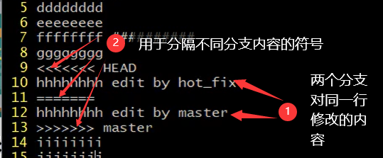

> **下载地址：**https://git-scm.com/

> git结构

1. 工作区：写代码，使用**git add**命令可提交至暂存区
2. 暂存区：临时存储，使用**git commit**命令可提交至本地库
3. 本地库：存储历史版本

#1.Git命令操作

> 本地库初始化

**git init**，会在当前文件夹下创建一个*.git*的隐藏目录存放本地库相关的子目录和文件，将当前目录变为工作区

> 设置签名

- 项目级别
  设置用户名：**git congif user.name 用户名**
  设置邮箱：**git config user.email 邮箱地址**
  设置的用户名和邮箱信息保存在*.git/config*文件中
- 系统用户级别
  **git config --global user.name 用户名**
  **git config --global user.email 邮箱地址**
  设置的用户名和邮箱信息保存在*当前系统用户的家目录/.gitconfig*文件中

项目级别优先于用户级别，二者都有是采用项目级别的签名，这里设置的签名和远程库的没有用户名，密码没有任何关系，仅用于区分不同人员对本地库的操作

> **git status：**查看当前仓库中文件的状态，未被加入到暂存区的文件为==Untracked files==

> **git add 文件名**

将工作区中对该文件的操作结果加入暂存区。如果文件在工作区进行了删除，同样需要执行该命令提交工作区中的删除操作，对暂存区的该文件进行删除来同步这个文件的版本

> **git rm --cached 文件名：**将文件从暂存区中删除

> **git commit 文件名**

将文件提交至本地库。执行该命令后会进入vim编辑器，可以在这里添加提交文件时的备注信息，添加完毕后保存退出即可完成此次提交；使用**git commit -m "提交备注" 文件名**可以不进入vim直接添加提交备注。如果一个文件已经添加到了暂存区，但工作区的文件进行了修改，那么这个文件可以使用**git commit -a**直接提交。对于暂存区中的文件删除操作同样需要使用该命令提交到本地库中以保持在不同区中的该本贱版本一致

> 查看提交日志（历史记录）

- **git log：**==HEAD ->==所标记的文件索引值为文件当前版本
- **git log --pretty=oneline：**以简洁模式显示日志
- **git reflog：**==HEAD@{num}==表示如果要回到某个版本需要多少步

> 前进或后退版本

本质就是操作==HEAD ->==指针，共有三种操作方式

- 基于索引值操作：**git reset --hard 版本索引值**，索引值可以是**git log**命令显示的完整的索引值，也可以是**git reflog**命令显示的部分索引值
- 使用^符号：**git reset --hard HEAD^**，有几个"^"符号就是回退几个版本；没有则表示当前版本，不进行回退，可用于对暂存区中文件误操作但没有提交到本地库时的文件进行恢复。这种方式只能后退
- 使用~符号：**git reset --hard HEAD~num**，num为要回退多少个版本，同样只能后退

reset命令共有三个可选参数：

- **--soft：**仅仅在本地库移动HEAD指针
- **--mixed：**在本地库移动HEAD指针，同时将暂存区文件的版本与本地库变化后的版本保持一致
- **--hard：**在本地移动HEAD指针，同时暂存区和工作区文件的版本与本地库变化后的版本保持一致，对于本地库的删除操作只是会作为这个文件的一个版本被记录在本地库中，并不会真正删除这个文件，不论对那个区的文件进行了误删除都只需要通过这个版本控制命令加**--hard**参数进行文件版本回退即可恢复

> 比较文件

**git diff 文件名：**将工作区的文件内容与暂存区的文件内容进行比较

**git diff HEAD 文件名：**将工作区的文件内容与本地库该文件当前版本的内容进行比较

**git diff HEAD^ 文件名：**将工作区的文件内容与本地库的该文件的前一个版本进行比较

# 2.分支操作

> 查看分支：**git branch -v**

第一部分表示分支名，==master==表示主分支初始化一个仓库时自动创建；“test branch hot_fix”为在该分支的本地库中最新提交的一个文件操作的备注信息

> 创建分支：**git branch 分支名**，==.git/HEAD==文件中记录了当前分支名字，新分支的各区内容与分支时主分支的内容相同，各分支之间的操作相互独立

> 切换分支：**git checkout 分支名**

> 合并分支：**git merge 要合并的分支名**

git中操作文件的最小单位是行，当不同的分支修改了同一文件的同一行数据，此时合并分支时会出现冲突。冲突表现形式为在这个文件中将两个分支的内容通过特殊符号分隔开。

**解决冲突：**

1. 使用vim进入该文件手动修改文件，删除多余的内容保存并退出
2. 使用**git add 文件名**将文件添加至暂存区
3. 使用**git commit -m "提交备注"**将文件提交至本地库，此命令不可以加文件名，否则报错

# 3.远程库操作

> 为远程仓库起别名：**git remote add 仓库别名 仓库地址**

> 查看起好别名的仓库：**git remote -v**

>删除创建好的仓库别名：**git remote rm 远程仓库别名**

> 将本地库推送至远程库：**git push 仓库别名 分支名**

执行该命令后需要输入账号和密码，输入第一次后Windows的凭据管理器会记住此次密码，后续的操作都不需要密码，如果想要切换账号登陆，则需要在凭据管理器中删除GitHub有关的凭据

> 克隆远程库到本地

**git clone 远程库地址**，如果是一个新的文件夹，执行该操作后会将远程库克隆到本地文件夹中，并将这个文件夹初始化为本地库，并且会为这个远程库创建一个"origin"的别名

> 拉取远程仓库内容

- **git fetch 远程仓库地址或别名 分支名：**仅仅只是将远程库某个分支的内容抓取下来，可以使用**git checkout 远程仓库别名/分支名**切换到抓取下来的分支，使用**cat 文件名**即可查看抓取到的内容。使用**git merge 远程仓库别名/分支名**将抓取到的远程分支与当前所在分支进行合并
- **git pull 远程仓库别名 分支名：**将远程仓库中指定的分支拉取下来，同时与本地库的当前分支进行合并

> 远程仓库的冲突问题

当多人操作同一仓库的同一分支时，先提交的会导致远程库该分支的版本前进一步，而导致另一个人的版本相对落后一步，此时另一个人再提交时就会出现版本冲突而不接受此次推送

**解决办法：**推送前先对线程库这个分支的最新版本进行拉取并合并到当前分支，此时合并会出现分支合并的冲突，解决方法同上。提交到本地库后执行推送命令即可

